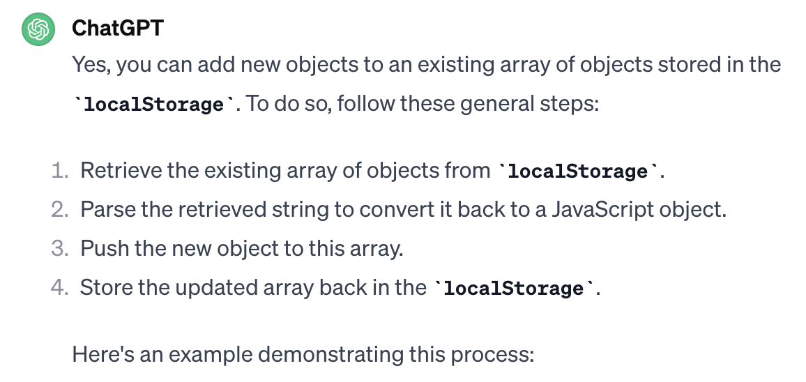
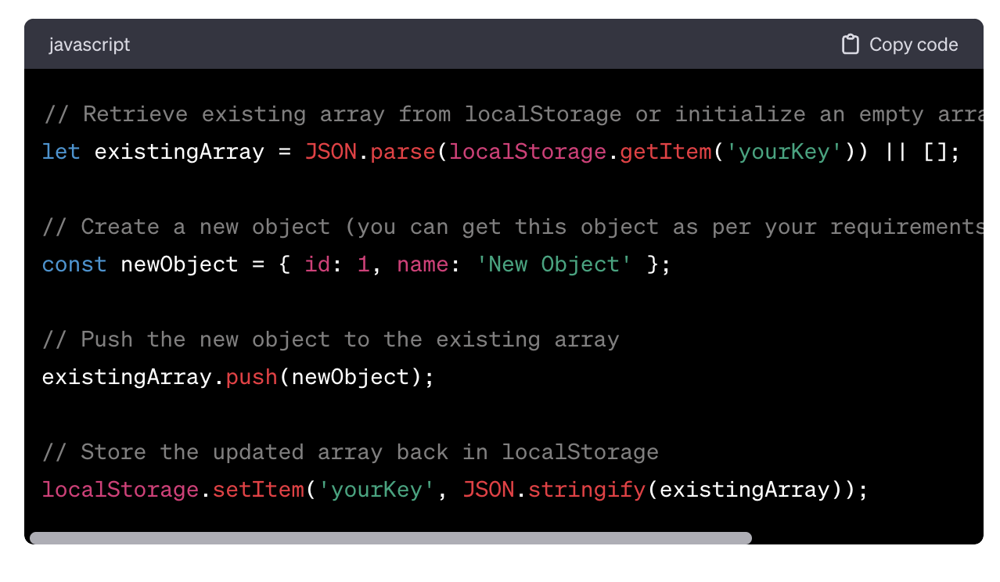

# Module 6 Challenge: Timed Quiz
Assignment 6 of the [Front-End Web Dev bootcamp][bootcamp-url] to create a timed quiz app.

****

<!-- PROJECT LOGO -->
 

<!-- Webpage icon -->
  

<h1 align="center">'Life in the UK</h1>

  
 Those applying for British citizenship or settlement in the UK have to take "Life in the UK" test. This quiz helps applicants test their knowledge.

    <!-- links to deployment -->
    <a href="https://icollier77.github.io/life-in-uk-quiz/" target="_blank">"Life in the UK" quiz</a>
    ·
    <a href="https://github.com/icollier77/life-in-uk-quiz" target="_blank">GitHub repo</a>
    ·
   
   

<!-- TABLE OF CONTENTS -->

  
Table of Contents

  <ol>
    <li>
      <a href="#about-the-project">About The Project</a>
      <ul>
        <li><a href="#project-goal">Project Goal</a></li>
        <li><a href="#project-specifications">Project Specifications</a></li>
        <li><a href="#sample-app">Sample App</a></li>
        <li><a href="#built-with">Built With</a></li>
      </ul>
    </li>
    <li><a href="#development">Development</a></li>
      <ul>
        <li><a href="#numbered-answer-options">Numbered answer options</a></li>
        <li><a href="#timer-code">Timer code</a></li>
        <li><a href="#timer-condition">Timer condition</a></li>
        <li><a href="#local-storage">Local storage</a></li>
        <li><a href="#removing-multiple-children">Removing multiple children</a></li>
        <li><a href="#logic-checks-for-initials">Logic checks for initials</a></li>
        <li><a href="#sort-array-of-objects">Sort array of objects</a></li>
        <li><a href="#final-challenge">Final challenge</a></li>
      </ul>
    <li><a href="#deployed-project">Deployed Project</a></li>
      <ul>
        <li><a href="#deployed-application">Deployed Application</a></li>
        <li><a href="#links-to-deployed-project">Links to Deployed Project</a></li>
      </ul>
  </ol>

<!-- ABOUT THE PROJECT -->
## About The Project

### Project Goal
The goal of this project is to practice Web APIs: DOM manipulation and using local storage.

### Project Specifications

The tasks for this challenge are outlined in the following requirements.

<b>The quiz app must have these features:</b>

<ol>
  <li>A start button that when clicked a timer starts and the first question appears.</li>
  <li>Questions contain buttons for each answer.</li>
  <li>When answer is clicked, the next question appears.</li>
  <li>If the answer clicked was incorrect then subtract time from the clock.</li>
  <li>The quiz should end when all questions are answered or the timer reaches 0.</li>
  <li>When the game ends, it should display their score and give the user the ability to save their initials and their score.</li>
</ol>

Not mandatatory, but we were also provided with the audio files with sounds to be played when the user answers correctly or incorrectly.

### Sample App

We were provided with the original demo of the quiz web app:

![inital screenshot][initial-img]

### Built With

We were provided with 3 files already built in:

[![HTML][html-badge]][html-url] [![CSS][css-badge]][css-url]

I wrote the code in 3 files:

[![JavaScript][js-badge]][js-url]

(<a href="#readme-top">back to top</a>)

<!-- The build process -->
## Development

This was the most challenging assignment up to now. Mastering the concepts of DOM, ways of manipulating DOM, creating new variables for it, and storing data in local storage as JSON were quite hard. I spent most of my time studying and trying to internalize the concepts.

When I started working on the assignment, I tried to use various loops to cycle through questions and answers. I quickly realized that regular loops do not work here as they run through all iterations without stopping for user input (which is required in this case: user has to select one of the answer choices).

Once I figured out how to solve this challenge, the rest of the work was quite fast. However, I did get stuck on 2 items:

* The condition for timer === 0 did not work (it worked well for timer < 0).
* To meet the demo gif design completely, I placed buttons within list items (`li`) but was not able to remove the styling for li:nth-child(odd).

For clarity, I placed all questions and their answers in the [Questions.js][questions-file] file, all logic in the [Logic.js][logic-file] file, and most code related to the scores in the [Scores.js][scores-file] file. There is some code related to scores still placed within the [Logic.js][logic-file] file - that is because the `html` elements that trigger this code are located in the [Index.html][index-file] file. If I were to move this code into the [Scores.js][scores-file] file to keep the code better organized, I would have to include a link to [Scores.js][scores-file] in the [Index.html][index-file] file but the task was **not to touch** the provided `html` and `css` files.

Finally (although this edge case was not specified in the requirements), the `css` styling alluded that we should be able to store multiple users in local storage and display a list of users and their scores on the [Highscores][scores-url] page Initially, I wrote the code for vanilla case (one user, always being overwritten in local storage by the latest player). But then I spent some time researching and re-writing the code to enable storing data for multiple players. I will expland more on this below.

### Data structure for questions and answers
I used this [video][quiz-video] to get an idea of how to structure the questions and answers data in the [Questions.js][questions-file] file.

### Numbered answer options

As I mentioned, this was one of the issues I was stuck on for a long time. I scheduled a session with a tutor - [Sara Neves Pereira][sara-github-url] and she helped me understand the issue and re-write the code. She advised not to use list items `li` but rather insert the number into the button text as `i + 1`.

### Timer code

I copied the code for the timer function from solved files on [GitLab (module 6, lesson 1, activity 10) (lines 9-33)][gitlab-timer-url].

### Timer condition

As I mentioned, I was stuck on the problem of timer === 0 for quite a while. I discussed it with [Ben Rumbold][ben-rumbold-url], a colleague in the [bootcamp][bootcamp-url], and he advised me to move this condition into the timer function directly. This finally solved the issue.

### Local storage

I wanted to store and retrieve multiple items from local storage, as this use case is closer to the real world.

This was quite a challenging issue. I researched online, but the best answer was provided to me by [ChatGPT][chatgpt-url]. Below are the instructions and the code I used in [Logic.js][logic-file] on lines 122, 125, 126:

### Removing multiple children

To be able to remove all user scores displayed on the [Highscores][scores-url] page, I used the code provided in snippet 2294, Option 2A provided on [StackOverflow][stackoverflow-url]. I used this code in [Scores.js][scores-file] on lines 19-21.

### Logic checks for initials

I wanted to remove all white spaces from the user's input (initials), and to prevent the user from using numbers or punctuation symbols. The following resources were helpful to understand how to remove all white spaces and also the use of regular expressions (**regex**) which I used in the [Logic.js][logic-file] file, lines 111 and 116:

* [How to Remove All Whitespace from a String in JavaScript][whitespace-url]
* [Check whether an input string contains a number in javascript][number-stack-url]
* [What is Punct in RegEx? How to Match All Punctuation Marks in Regular Expressions][punct-regex-url]

### Sort array of objects

Finally, I wanted to sort the array of players' results based on the scores, in descending order. The code snippet 2193 in this [discussion][sort-array-url] was very helpful and I used it in [Scores.js][scores-file], line 8.

### Final challenge

My code includes an event listener on a button within a `forEach` method in the [Logic.js][logic-file] file, lines 72-91. All my attempts (and also the tutor's attempts) to take it out resulted in the code being broken.

I know that having an event listener inside another function is not the best solution, and in fact, would cause issues in a larger program. This is something for me to keep learning and refining so that I avoid such issues in the future.

**UPDATE on final challenge**

I have read [an article on event delegation][event-delegation-url] which has greatly helped me understand both the problem and the solution. Based on this, I was able to take out the event listener and place it separately. This has resolved this issue.

(<a href="#readme-top">back to top</a>)

<!-- Deployed project -->
## Deployed project

The project is now live.

### Deployed application

The deployed page looks like this:

![Deployed page][deployed-gif]

### Links to deployed project

You can find the "Life in the UK" quiz and its corresponding code here:

- [ ] ["Life in the UK" quiz][deployed-url]
- [ ] [Project repo][repo-url]

(<a href="#readme-top">back to top</a>)

#### Credit:

    
Attribution

- Quiz icon from [Flaticon][flaticon-url] created by [Vitaly Gorbachev][quiz-icon-url].

<!-- MARKDOWN LINKS & IMAGES -->
[deployed-gif]: ./assets/deployed-quiz.gif

[deployed-url]: https://icollier77.github.io/life-in-uk-quiz/index.html

[repo-url]: https://github.com/icollier77/life-in-uk-quiz

[initial-img]: ./assets/08-web-apis-challenge-demo.gif

[html-badge]: https://img.shields.io/badge/HTML-blue?logo=html5&logoColor=white
[css-badge]: https://img.shields.io/badge/CSS-orange?logo=CSS3
[js-badge]: https://img.shields.io/badge/JavaScript-purple?logo=Javascript&logoColor=white
[html-url]: https://www.w3schools.com/html/
[css-url]: https://www.w3schools.com/css/default.asp
[js-url]: https://www.w3schools.com/js/default.asp

[quiz-icon-url]: https://www.flaticon.com/free-icon/quiz_4455825?term=quiz&page=1&position=83&origin=tag&related_id=4455825
[flaticon-url]: https://www.flaticon.com/

[bootcamp-url]: https://www.edx.org/boot-camps/coding/skills-bootcamp-in-front-end-web-development

[quiz-video]: https://www.youtube.com/watch?v=PBcqGxrr9g8

[gitlab-timer-url]: https://git.bootcampcontent.com/uk-edx-16-week/UK-VIRT-FE-PT-11-2023-U-LOLC/-/blob/main/06-web-apis-module/01-intro-api-lesson/activities/10-Stu-Timers-Intervals/solved/assets/js/script.js?ref_type=heads

[ben-rumbold-url]: https://github.com/Ben-Rumbold

[chatgpt-instructions]: ./assets/ChatGPT-instructions.png

[chatgpt-code]: ./assets/ChatGPT-code.png

[logic-file]: ./starter/assets/js/logic.js
[scores-file]: ./starter/assets/js/scores.js
[questions-file]: ./starter/assets/js/questions.js
[index-file]: ./index.html
[highscores-file]: ./highscores.html
[scores-url]: https://icollier77.github.io/life-in-uk-quiz/highscores.html
[stackoverflow-url]: https://stackoverflow.com/questions/3955229/remove-all-child-elements-of-a-dom-node-in-javascript

[chatgpt-url]: https://chat.openai.com/

[sara-github-url]: https://github.com/SaraNP-33

[punct-regex-url]: https://www.freecodecamp.org/news/what-is-punct-in-regex-how-to-match-all-punctuation-marks-in-regular-expressions/

[whitespace-url]: https://javascript.plainenglish.io/javascript-remove-all-whitespace-from-string-ece685d0ec33#:~:text=To%20remove%20all%20whitespace%20from%20a%20string%20in%20JavaScript%2C%20call,all%20whitespace%20removed%20from%20str%20

[number-stack-url]: https://stackoverflow.com/questions/5778020/check-whether-an-input-string-contains-a-number-in-javascript

[sort-array-url]: https://stackoverflow.com/questions/979256/sorting-an-array-of-objects-by-property-values

[event-delegation-url]: https://bootcamp.uxdesign.cc/mastering-event-delegation-in-javascript-simplify-your-code-and-boost-performance-785a866c351d